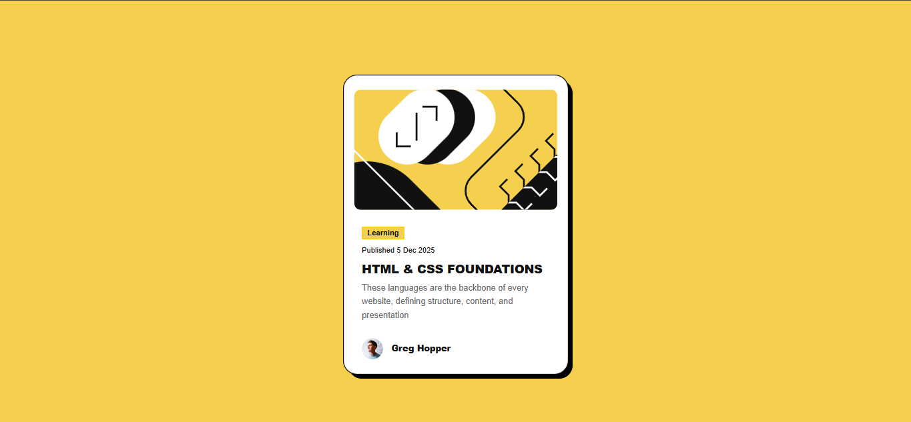
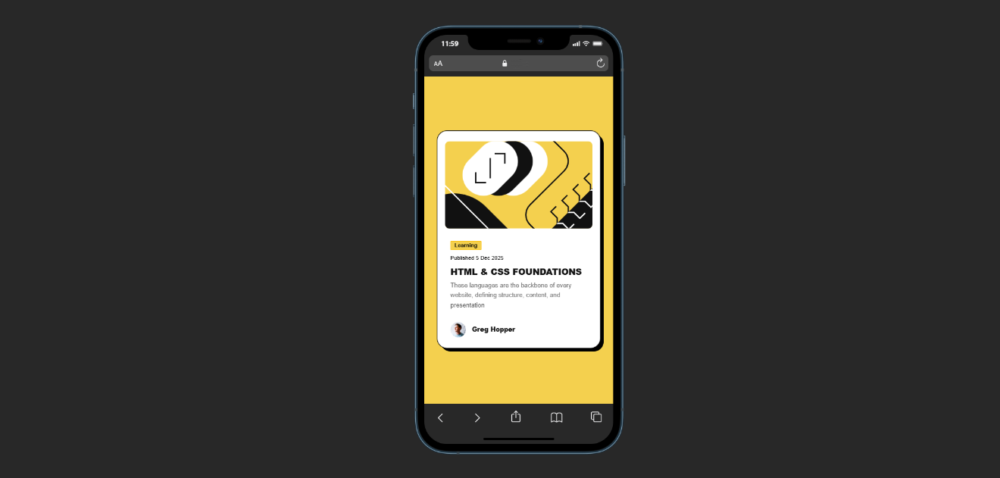

# Frontend Mentor - Blog preview card solution

This is a solution to the [Blog preview card challenge on Frontend Mentor](https://www.frontendmentor.io/challenges/blog-preview-card-ckPaj01IcS).

## Table of contents

- [Overview](#overview)
  - [Screenshot](#screenshot)
  - [Links](#links)
- [My process](#my-process)
  - [Built with](#built-with)
  - [What I learned](#what-i-learned)
  - [Continued development](#continued-development)
  - [Useful resources](#useful-resources)
- [Author](#author)


## Overview

### Screenshot






### Links

- Solution URL: [https://github.com/micdynas/blog-preview-card-main/tree/main]()
- Live Site URL: [https://micdynas.github.io/blog-preview-card-main/]()

## My process

### Built with

- Semantic HTML5 markup
- CSS
- Bootstrap

### What I learned
I learned how to embedd downloaded fonts into the css code

```css
 @font-face {
    font-family: "Figtree";
    src: url('assets\fonts\Figtree-Italic-VariableFont_wght.ttf') format("Woff2"),
         url('assets\fonts\Figtree-VariableFont_wght.ttf') format("Woff2");
 }
```

### Continued development

I would like to further learn how to compact and reduce my css code to make it easier to read and implement 

### Useful resources

- (https://getbootstrap.com/docs/5.3/components/card/)- At some point i got stuck on how to implement the card component in bootstrap and this helped

## Author
- Frontend Mentor - @micdynas

